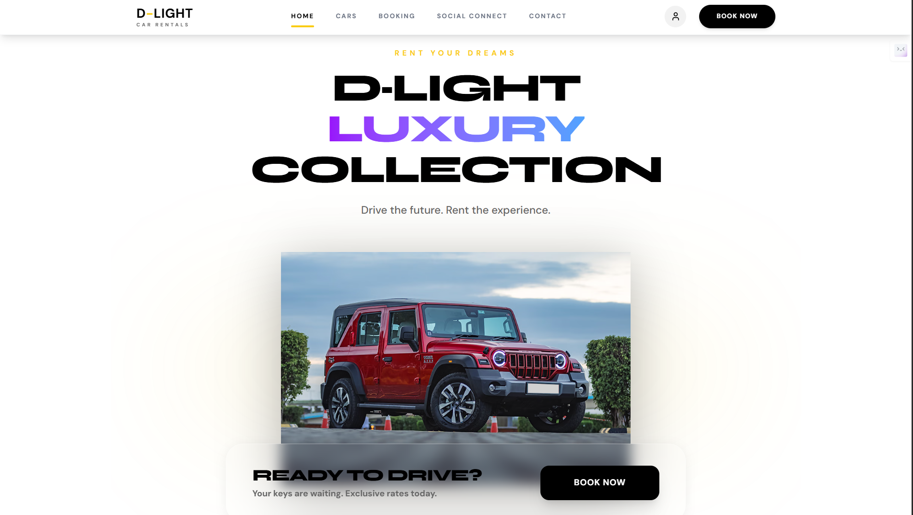
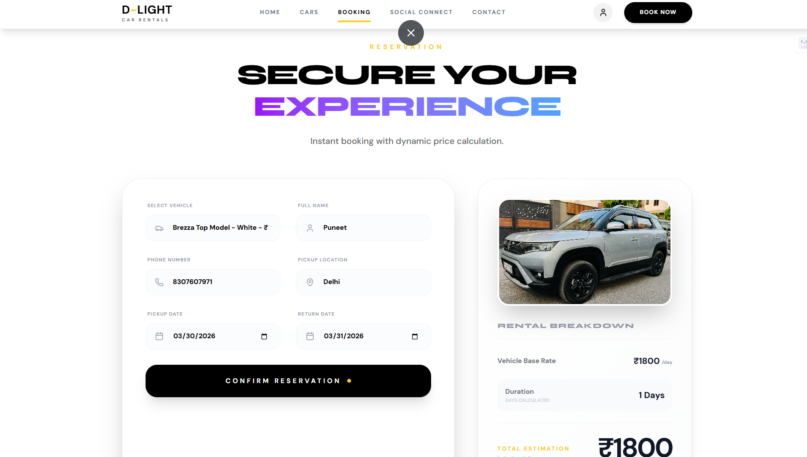
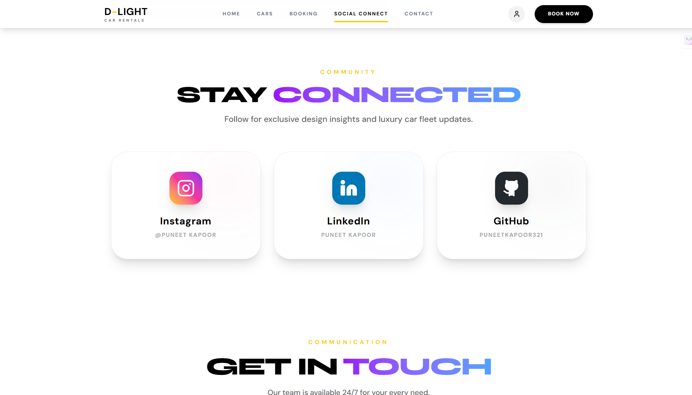
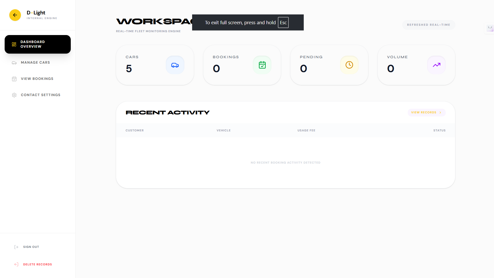

# 🚘 D-LIGHT — Luxury Car Rental Platform

> **Drive the future. Experience the premium.**

D-LIGHT is a **full-stack luxury car rental web application** built to deliver a seamless, high-performance booking experience with a modern, app-like interface.

It combines a **fast React frontend** with a **scalable FastAPI backend**, enabling real-time fleet management, smooth booking flows, and a powerful admin control system.

---

## 🔗 Live Demo

👉 https://d-light-fullstack-app.vercel.app/

---

## 🎯 Why I Built This

Most car rental platforms feel outdated, slow, and cluttered.

D-LIGHT was built to:

* Deliver a **premium UI/UX experience**
* Practice **real-world full-stack development**
* Build a **complete admin + user system**
* Showcase my ability to create **production-ready applications**

---

## 🛠️ Tech Stack

### Frontend

* React 19 + Vite
* TypeScript
* Tailwind CSS + Custom CSS
* Lucide React Icons

### Backend

* FastAPI
* SQLite + SQLAlchemy
* JWT Authentication
* Uvicorn

---

## ⚙️ Features

### 👤 User Features

* Smooth single-page experience (SPA)
* Live vehicle listings
* Dynamic booking system
* Responsive design (mobile + desktop)
* WhatsApp booking integration

---

### 🛡️ Admin Features

* Add / Edit / Delete vehicles (CRUD)
* Upload vehicle images
* Toggle vehicle status (Active / Offline)
* Manage bookings dashboard
* Real-time updates across frontend
* Global settings control

---

## 🧠 How It Works

* Frontend uses **React Context API** for state management
* Backend exposes **FastAPI endpoints** for all operations
* SQLAlchemy manages structured database interactions
* Admin updates instantly reflect on the frontend

---

## 📸 Screenshots

### 🏠 Home Page


### 📅 Booking Flow


### Social Connection Page


### 🛡️ Admin Dashboard



## 🚀 Run Locally

### 1. Clone Repository

```bash
git clone https://github.com/your-username/d-light.git
cd d-light
```

---

### 2. Backend Setup

```bash
cd backend

python -m venv venv
venv\Scripts\activate   # Windows
# source venv/bin/activate   # macOS/Linux

pip install -r requirements.txt
uvicorn main:app --reload --port 8000
```

---

### 3. Frontend Setup

```bash
cd frontend

npm install
npm run dev
```

---

### 🔐 Admin Access

* URL: `/admin/login`
* Username: `admin`
* Password: `dlight2024`

---

## 📦 Project Structure

```bash
frontend/
  ├── components/
  ├── pages/
  ├── context/
  └── assets/

backend/
  ├── main.py
  ├── models.py
  ├── database.py
  └── routes/
```

---

## 🚧 Challenges & Learnings

* Managing frontend ↔ backend synchronization
* Handling state persistence and API reliability
* Designing a clean admin dashboard
* Debugging real-world issues and optimizing performance

---

## 🔮 Future Improvements

* Cloud image storage (Cloudinary / AWS S3)
* Payment gateway integration
* User authentication system
* Advanced analytics dashboard

---

## 👨‍💻 About Me

**Puneet Kapoor**
Full-Stack Developer passionate about building modern, scalable, and user-focused applications.

* 🔗 LinkedIn: https://www.linkedin.com/in/puneet-kapoor-b501b5338/
* 📸 Instagram: https://www.instagram.com/i.punitkapoor_/
* 💻 GitHub: https://github.com/Puneetkapoor321

---

## ⭐ Final Note

This project reflects my ability to:

* Build full-stack applications
* Design modern UI/UX
* Solve real-world problems
* Write clean and maintainable code

If you like this project, consider giving it a ⭐ and connecting with me.
